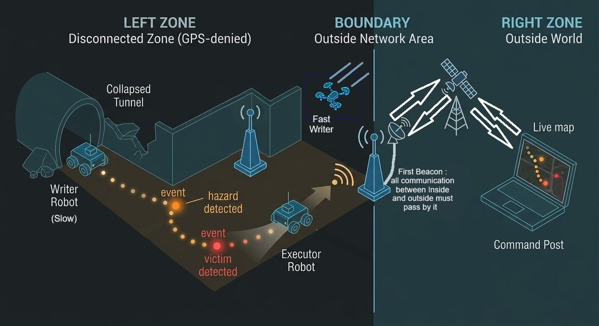
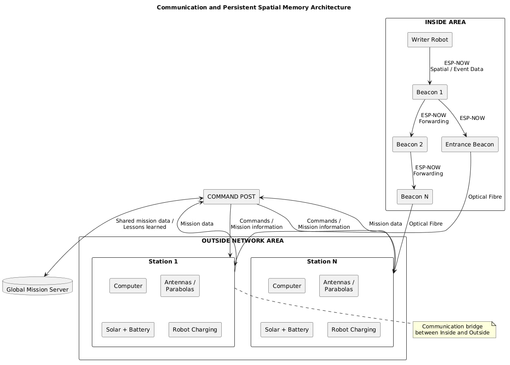
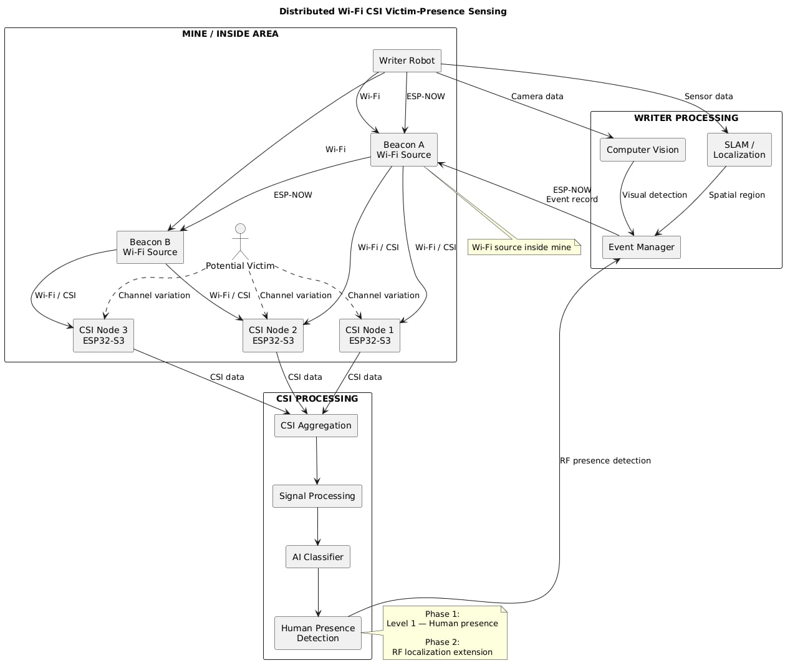

# Technical Architecture Diagrams — The Living Map

TSYP14 · IEEE RAS × IEEE AESS Tunisia Section Chapters Technical Challenge

Three diagrams of the system: the overall concept, how information travels and is kept, and how Wi-Fi CSI senses a person's presence.

| Diagram | File |
|---|---|
| 1. System concept: three zones | [system-concept.jpg](system-concept.jpg) |
| 2. Communication and persistent spatial memory | [communication-architecture.jpg](communication-architecture.jpg) |
| 3. Distributed Wi-Fi CSI victim-presence sensing | [csi-sensing.jpg](csi-sensing.jpg) |

## 1. System concept: three zones

- **Left zone: the mine, disconnected and without GPS.** The slow **Writer** robot explores the tunnels and leaves a trail of radio beacons behind it. Along the way it records events, such as a hazard or a victim. The **fast Writer** (a drone) looks for victims quickly. The **Executor** robot later follows the stored trail to the victim.
- **Boundary: the Outside Network Area.** The **first beacon** of each entrance is the only gateway: all communication between the inside and the outside passes through it. A station with antennas links it to the outside.
- **Right zone: the outside world.** Information goes through the relay satellite or the antenna mast to the **Command Post**, which shows a live map of the mine.

## 2. Communication and persistent spatial memory

- **Inside the mine,** the Writer sends spatial and event data to the nearest beacon over **ESP-NOW**. Beacons forward it hop by hop, so every record is stored in the beacons and survives even if the Writer fails.
- **Optical fibre** connects the entrance beacon to its **Outside Network station**. Each station has a computer, antennas or parabolic dishes, solar panels with a battery, and robot charging.
- **The stations** send mission data to the **Command Post** and pass its commands and mission information back toward the entrance.
- **The Command Post** shares mission data and lessons learned with the **global mission server**, so each mission helps the next ones.

## 3. Distributed Wi-Fi CSI victim-presence sensing

- **Wi-Fi sources inside the mine:** the Writer and the beacons emit Wi-Fi, without any outside connection.
- **ESP32-S3 CSI nodes** spread around the area measure the Wi-Fi channel. A person changes it by being there, breathing or moving.
- **CSI processing:** aggregation → signal processing → **AI classifier** → human-presence detection. Phase 1 is Level-1 presence; Phase 2 extends it to RF localization.
- **On the Writer,** computer vision gives visual detections and SLAM gives the spatial region. The **event manager** combines them with the RF presence detections and writes an event record to the nearest beacon over ESP-NOW.
- **Two separate networks:** ESP-NOW carries communication, and Wi-Fi CSI does the sensing. CSI nodes can therefore be added locally without changing the beacon network.

## In the simulation

The Phase 1 simulation in [simulation-demo](../simulation-demo/) implements these three architectures:

| Diagram | In the simulation |
|---|---|
| 1. System concept | Slow ground Writers and flying fast Writers; beacon trail; hazard and victim events; Executor following the trail; first beacon at each entrance; Outside Network stations, relay satellite, and the Command Post's live map in the 2D window |
| 2. Communication and memory | ESP-NOW radio model with hop-by-hop forwarding and 32-byte event records; optical fibre from the entrance beacon to three stations (computer, dish, solar panels, battery, charger); Command Post and a mission server that keeps each mission's lessons |
| 3. Wi-Fi CSI sensing | ESP32-S3 CSI nodes dropped by the Writers; beacons and Writers as Wi-Fi sources; aggregator beacons run the presence classifier; presence fused with the camera detections into one victim hypothesis |

## Related documents

- [Technical Report](../Technical%20Report/): the technical report
- [failure-cases](../failure-cases/): the 18 failure cases and their mitigations
- [implementation-plan](../implementation-plan/): the implementation and validation plan
